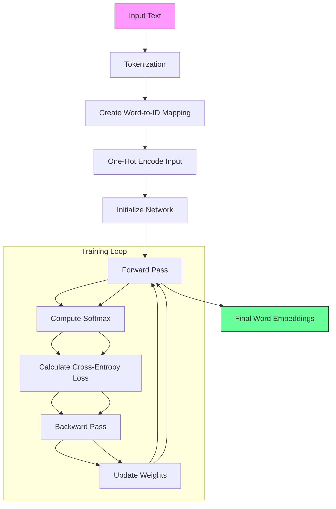

# Search engine
## Process

```mermaid
graph TD
  A[Input Text] --> B[Tokenization]
  B --> C[Create Word-to-ID Mapping]
  C --> D[One-Hot Encode Input]
  D --> E[Initialize Network]
  E --> F[Forward Pass]
  F --> G[Compute Softmax]
  G --> H[Calculate Cross-Entropy Loss]
  H --> I[Backward Pass]
  I --> J[Update Weights]
  J --> F
  F --> K[Final Word Embeddings]

  subgraph "Training Loop"
    F --> G --> H --> I --> J --> F
  end

  style A fill:#f9f,stroke:#333
  style K fill:#6f9,stroke:#333
```

## Sources
Mikolov, Tomas, et al. "Efficient Estimation of Word Representations in Vector Space." arXiv preprint arXiv:1301.3781 (2013). https://arxiv.org/abs/1301.3781
